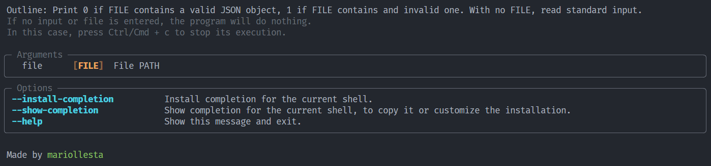

<p align="center">
<em>Writting my own JSON parser tool</em>
</p>


---

## About

Following the guidelines of the [Coding Challenges blog](https://codingchallenges.fyi/challenges/challenge-json-parser), the goal of this project is the development of a proprietary version of a JSON parser tool, which it's been called **_myjsonp_**.

> Give me a star if you find it useful :)

---

## Requirements

[](https://python.org)
[](https://pypi.org/project/pip/)


---

## Set up

Download the application repository:

```terminal
git clone https://github.com/mariollesta/my-own-JSONparser.git
```

> [!Note]
> It will be downloaded to the directory where we are located in our terminal by executing the command

Install the packages:

- To install the package locally in the user's directory, which means that it will only be available to the user who performed the installation

```terminal
pip install --user <PATH>/myjsonp-<version>-py3-none-any.whl
```

- To install the package globally on the system, which means that it will be available to all users on the system. May require elevated (administrative) permissions to install the package.

```terminal
pip install <PATH>/mywc-<version>-py3-none-any.whl
```

> [!Note]
> If the program does not work, check that the directory where the executable is located is in the PATH variable of the system.

---

## How to use

This tool has no options, it simply needs a file passed as a parameter or a standard input.

We can execute the option --help to see more details.

```terminal
myjsonp --help
```

You will see something like what is shown in the following image:



Thus, we could execute the command in two ways:

- Passing a file as a parameter
  ```terminal
  myjsonp <PATH to file>
  ```

- Through standard input
  ```terminal
  cat <PATH to file> | myjsonp 
  ```

